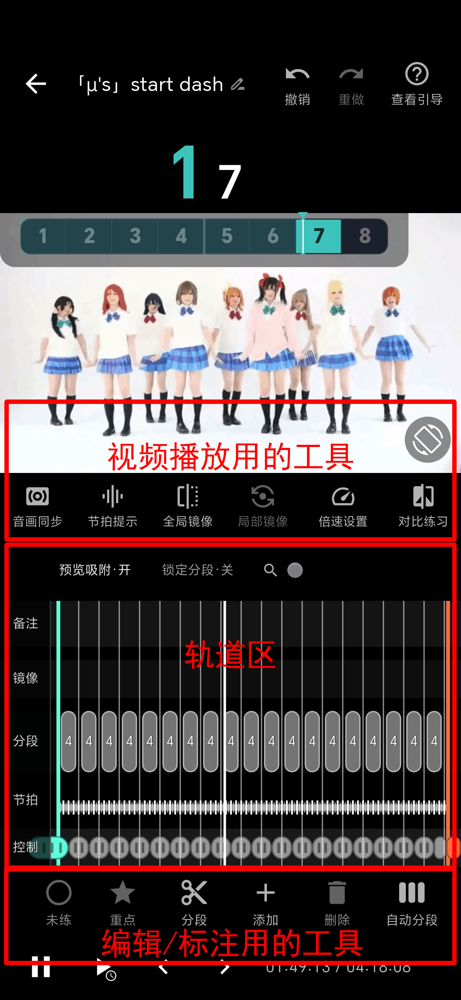

# 控制界面概述

操作逻辑借鉴了剪辑软件，如果你用过剪映等软件，应该很容易上手

## 控制界面分区

靠上的工具栏是和播放有关的设置

中间是轨道区，固定包含五条轨道

下面一排工具是用来分段和添加标注的

## 轨道

- 备注：放备注贴纸（见[《备注与镜像》](../05-备注与镜像/备注与镜像.md)）
- 镜像：放局部镜像片段（见[《备注与镜像》](../05-备注与镜像/备注与镜像.md)）
- 分段：放分段情况（见[《分段》](../04-分段/分段.md)）
- 节拍：用竖线代表一拍，也可以用来放半拍标记（见[《节拍》](../03-节拍/节拍.md)）
- 控制：放分段线的小把手，用来调整分段线位置和选中分段线（见[《分段》](../04-分段/分段.md)）
