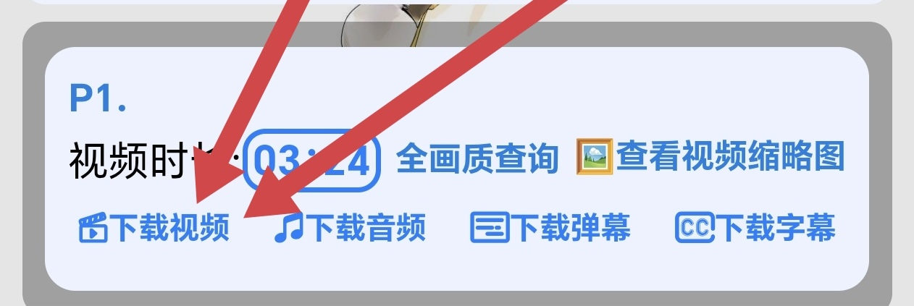
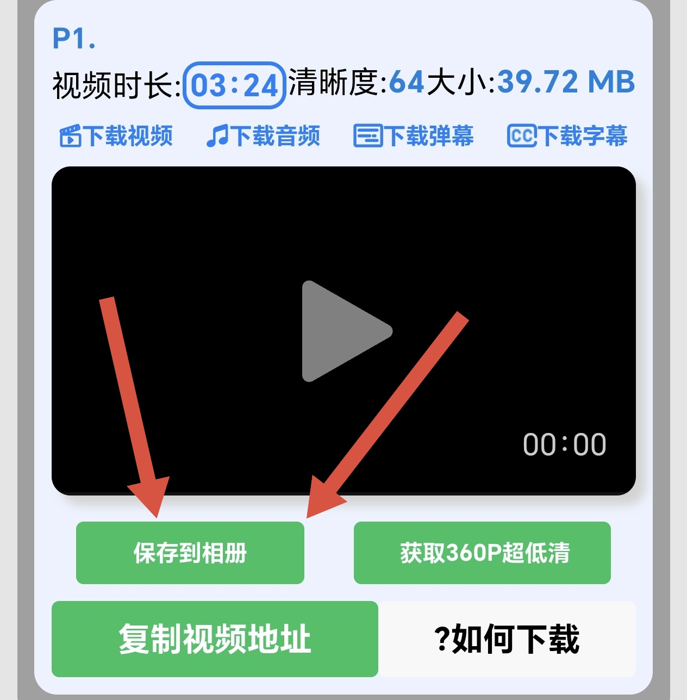
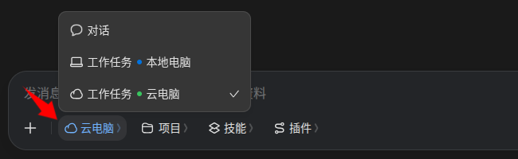

# 下载视频

把舞蹈视频存到手机相册，再导入 App 练习。下面三种方法任选一种。

## 方法一：微信小程序下载B站视频（推荐）

> 注意：如果要下载大量视频，建议使用[方法三](#方法三电脑下载b站视频)

### 1. 微信小程序搜索「唧唧Down」
### 2. 搜索并选择你想下载的视频
### 3. 往下拉，点击「下载视频」

### 4. 点击「保存到相册」

## 方法二：基于豆包的通用方法

1. 找到你想下载的视频（B站、抖音、小红书等平台都可以）
2. 点击「分享」按钮
3. 点击「复制链接」
4. 打开豆包（APP或网页端都可以）
5. 切换为「工作任务」模式（推荐用云端电脑）

6. 告诉豆包你想下载的视频
   例如
   - 请帮我下载这个视频（粘贴链接）
   - 请帮我下载这个合集的前三个视频（粘贴链接）
7. 等豆包工作完成后，点击视频的下载按钮即可

## 方法三：电脑下载B站视频

1. 打开唧唧Down官网 https://www.jijidown.com/
2. 下载PC客户端
3. 根据软件内的提示完成视频下载
4. 用QQ或微信将视频发送到手机
5. 在手机上保存视频
