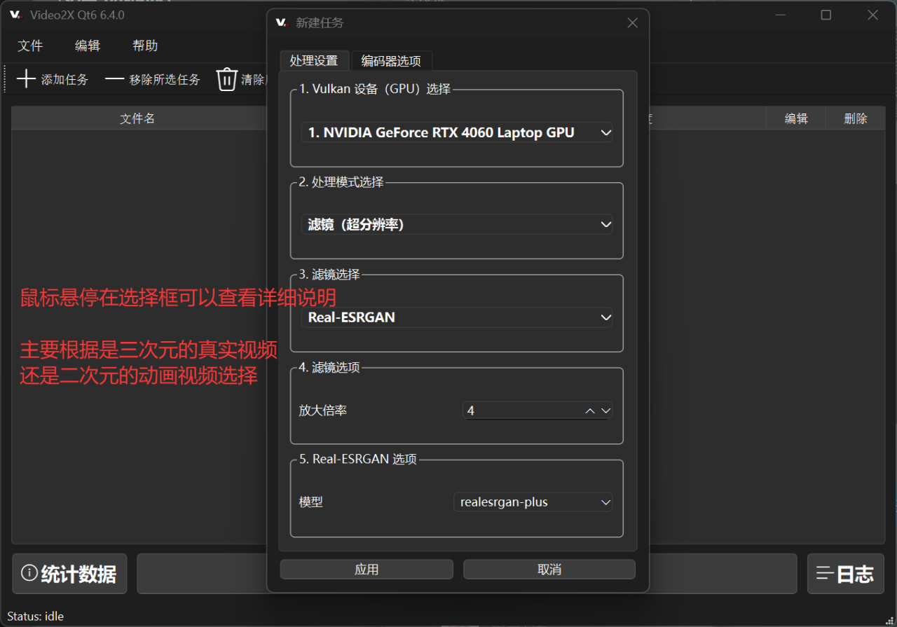

# 用电脑将视频变清晰

用Video2X开源工具，在Windows电脑上免费把视频变清晰

> 使用Video2X开源软件

1. 下载Video2X
   - 百度网盘：[https://pan.baidu.com/s/15e7SbJJvS4qLit6212Nvug?pwd=1103](https://pan.baidu.com/s/15e7SbJJvS4qLit6212Nvug?pwd=1103)
   - 夸克网盘：[https://pan.quark.cn/s/e08ba6cee830](https://pan.quark.cn/s/e08ba6cee830)
   - Github：[https://github.com/k4yt3x/video2x](https://github.com/k4yt3x/video2x)

2. 双击文件，完成安装
3. Video2X挺方便的，就不详细列步骤了

   到下面这步的时候，鼠标悬停在选择框可以查看详细说明，
   根据说明选择参数

   
